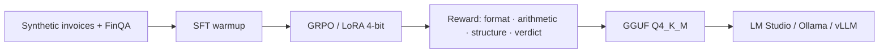

# AuditLM

**A 3B-parameter local LLM that audits invoices with verifiable math, not vibes.**

AuditLM flags arithmetic fraud, duplicate line items, and tax inconsistencies, then shows its work inside `<think>` traces. Fine-tuned with **GRPO** (Group Relative Policy Optimization) on Qwen2.5, quantized to **GGUF Q4**, and runnable on a laptop GPU (~4 GB VRAM) via LM Studio or Ollama.

```
Invoice in  →  <think> line items × qty, subtotal, tax, duplicates </think>  →  Verdict: Valid | Flagged
```

---

## Why it exists

Financial LLMs often *sound* confident while getting the arithmetic wrong. AuditLM is trained to:

- Recalculate every line item (`qty × unit price`)
- Re-sum the subtotal and tax
- Detect duplicate-line injection
- Emit a structured **Valid / Flagged** verdict with a reason

All inference is **on-device**. No API keys, no data leaving the machine.

---

## Results

Held-out eval: **40 samples** (29 invoice audits, 7 FinQA, 4 financial reasoning). Full tables in [`eval_results/comprehensive_eval_report.md`](eval_results/comprehensive_eval_report.md).

| Model | Overall Acc. | Invoice Acc. | F1 | MCC | Format `<think>` |
|-------|--------------|--------------|----|-----|------------------|
| Qwen2.5-1.5B (baseline) | 42.5% | 58.6% | 0.54 | 0.19 | 62.5% |
| SFT 1.5B | 32.5% | 44.8% | 0.58 | 0.21 | **97.5%** |
| GRPO 1.5B | 40.0% | 55.2% | 0.43 | 0.06 | **97.5%** |
| **GRPO 3B (shipped)** | **52.5%** | **72.4%** | **0.67** | **0.44** | **97.5%** |

Headline takeaway: the 3B GRPO run lifts invoice-audit accuracy **+13.8 pp** vs the 1.5B baseline and more than doubles MCC (0.19 → 0.44). SFT taught format; GRPO + scale taught *when* to flag.

> Small eval set — treat numbers as directional, not a production SLA.

---

## Method



1. **Data** — hybrid set: synthetic invoices with injected fraud (wrong totals, tax mismatch, duplicates, line-item padding) plus FinQA / FinanceReasoning for quantitative QA.
2. **SFT** — QLoRA on Qwen2.5-Instruct so the model speaks `<think>…</think>` + `Verdict:`.
3. **GRPO** — group-relative policy optimization with a composite reward (format, reasoning depth, executable arithmetic, structure, verdict).
4. **Export** — merged adapter → `auditlm-3b-q4_k_m.gguf` (~1.8 GB).

Stack: **Unsloth · TRL GRPO · PEFT LoRA · Qwen2.5 · GGUF**.

---

## Example

**Input (fraud):** 8 units × $82.27 listed as **$630.26** (true product is $658.16).

**Output (expected):**

```
<think>
1. Line Item Verification:
   - 8 x $82.27 = $630.26 -> Error (Computed: $658.16 vs Stated: $630.26)
   ...
</think>

Verdict: Flagged
Reason: Line item math error on 'Ameliorated bandwidth-monitored knowledgebase'.
```

---

## Run it locally

Weights are **not** in git (~1.8 GB). Place `auditlm-3b-q4_k_m.gguf` at `models/auditlm_3b_gguf/` — see [`models/README.md`](models/README.md).

### LM Studio (Windows / macOS — recommended demo)

Follow **[`setup_guide.md`](setup_guide.md)** — import the GGUF, paste the system prompt, run the sample invoice. No Python.

### Ollama

```bash
ollama create auditlm -f inference/Modelfile
ollama run auditlm
```

### OpenAI-compatible API (Ollama · LM Studio · vLLM)

```bash
# Ollama :11434  |  LM Studio :1234  |  vLLM :8000
python scripts/live_demo_vllm.py --url http://localhost:11434/v1 --model auditlm --example
```

Canonical prompts live in [`scripts/prompts.py`](scripts/prompts.py) and [`inference/PROMPTS.md`](inference/PROMPTS.md). Do not improvise the system prompt — it matches training.

| Runtime | Hardware | Notes |
|---------|----------|--------|
| LM Studio / Ollama | ~4 GB VRAM or 8 GB RAM | Best for sharing |
| vLLM | Linux / WSL2 GPU | Throughput serving |
| Unsloth 4-bit | ~3–4 GB VRAM | LoRA adapter, not GGUF |

---

## Train / evaluate

NVIDIA GPU + CUDA + Unsloth.

```bash
python -m venv .venv && source .venv/bin/activate
pip install -r requirements-train.txt

python scripts/build_unified_dataset.py
python scripts/train_sft.py
python scripts/train_grpo.py
python scripts/export_3b_gguf.py
python scripts/comprehensive_eval.py
```

---

## Repository

```
AuditLM/
├── setup_guide.md              # LM Studio handoff (non-technical)
├── inference/                  # Ollama Modelfile, prompts, LM Studio notes
├── scripts/
│   ├── prompts.py              # Single source of truth for chat templates
│   ├── train_sft.py / train_grpo.py
│   ├── comprehensive_eval.py
│   └── live_demo*.py
├── datasets/                   # Train/eval JSON (large corpora gitignored)
├── eval_results/               # Metrics + report
└── models/                     # GGUF + LoRA (gitignored; download separately)
```

---

## Limitations

- Eval is **40 examples** — not a regulatory benchmark.
- Best on **invoice arithmetic / structural fraud**, weaker on long-form financial QA.
- Not a substitute for a human auditor or a deterministic rules engine.
- 1.5B GRPO underperformed 3B; scale mattered more than GRPO alone on this set.

---

## License

Research prototype. Base model: [Qwen2.5](https://huggingface.co/Qwen) (see Qwen license). Add a repo `LICENSE` before a public release.

Fine-tuned with [Unsloth](https://github.com/unslothai/unsloth) and [TRL GRPO](https://huggingface.co/docs/trl/grpo_trainer).
